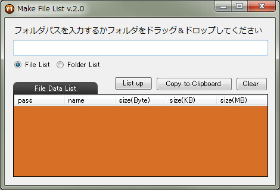

# MakeFileList
ファイルパス・フォルダパスをリストアップするツール  

**◆『MakeFileList』について**  
　  
　使用時は MakeFileList_v2.exe を実行してください。  
　  
　  
　  
　空欄にリストアップしたいフォルダパスを入力します。  
　ファイルやフォルダをドラッグ＆ドロップしてもOKです。  
　  
　ファイルをリストアップするかフォルダをリストアップするかラジオボタンで選びます。  
　  
　「List up」ボタンを押します。  
　するとツール下部のウインドウにリストアップされます。  
　  
　「Copy to Clipboard」ボタンでクリップボードにコピーします。  
　  
**◆更新履歴**  

　2018. 9. 15 v.1  
　　ファイルのリストアップが可能になる  
　2018. 9. 15 v.2  
　  フォルダのリストアップにも対応  
　  
moko

